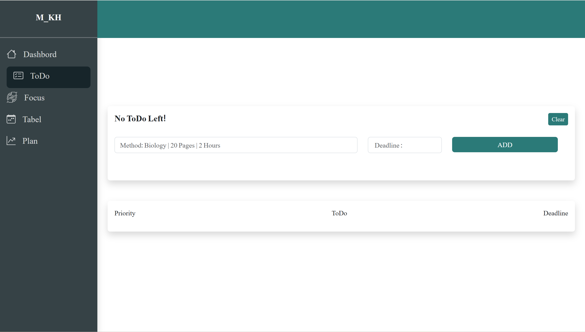
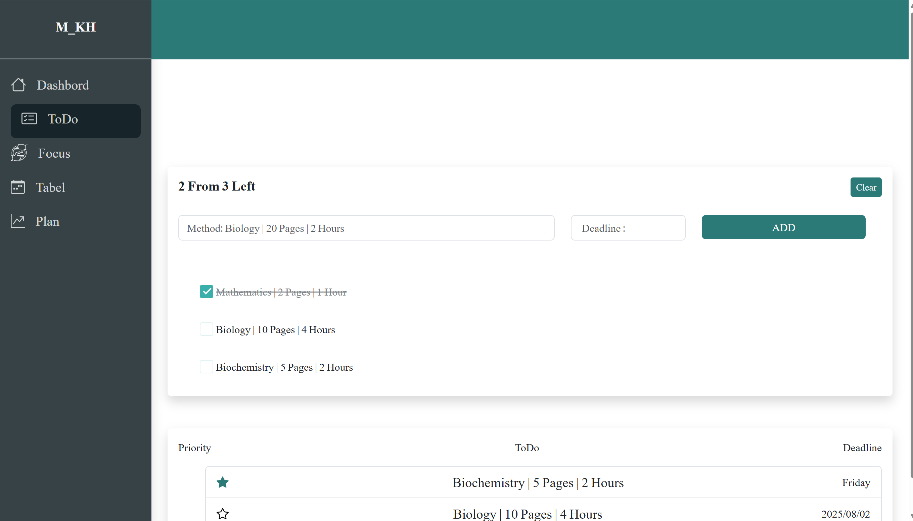
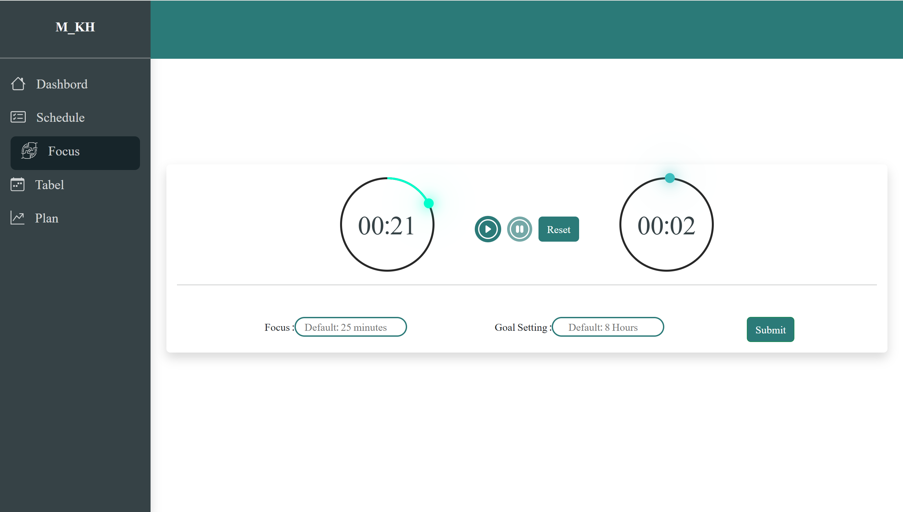

# ⏳ Focus Flow  

Stay productive with a smart to-do list and a fully customizable focus timer. Organize your tasks by project name, deadline, and priority, while dual timers help you track both deep work and study sessions effortlessly!   

## 🌟 Features  
✅ Smart To-Do List with project name, deadline & priority  
⏲️ Dual Timers for focus & study sessions  
🎯 Fully customizable timer settings  
📊 Track your progress and stay organized  
🌐 Responsive design for all devices  
🚧 *In Development* — More exciting features coming soon!  

## 🛠️ Built With  
- **Vanilla JavaScript** — for logic and interactivity  
- **Bootstrap** — for modern and responsive UI  

📸 Screenshots

## 📬 Contact

Feel free to reach out via [GitHub](https://github.com/mahla-kh) !

---

⭐️ *If you like this project, give it a star!*
